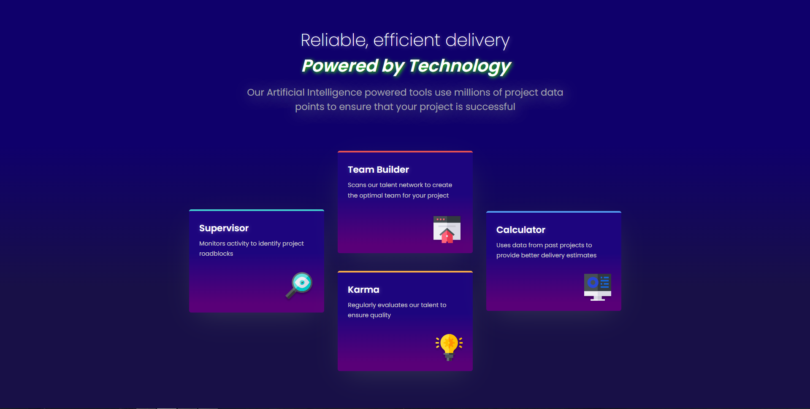

# Frontend Mentor - Four card feature section solution

**Hello! :wave:**
This is a solution to the [Four card feature section challenge on Frontend Mentor](https://www.frontendmentor.io/challenges/four-card-feature-section-weK1eFYK). Frontend Mentor challenges help you improve your coding skills by building realistic projects.

## Table of contents

- [Overview](#overview)
  - [The challenge](#the-challenge)
  - [Screenshot](#screenshot)
  - [Links](#links)
- [My process](#my-process)
  - [Built with](#built-with)
  - [What I learned](#what-i-learned)
  - [Continued development](#continued-development)
- [Author](#author)
- [Acknowledgments](#acknowledgments)

## Overview

### The challenge

Users should be able to:

- View the optimal layout for the site depending on their device's screen size

### Screenshot

#### Dark Theme( customized theme✨ )

#### Light Theme( normal theme - boring one)

### Links

- Live Site URL: [Here](https://igafshell.github.io/four-card-feature-section-main/)

## My process

### Built with

- HTML5 markup
- Vanilla CSS
- Mobile-first workflow
- SVG

### What I learned

I learned:

- How to work with svg and combine it with html & css
- How to make custom animations
- How to make a dark and light themes
- How to make text glow( `text-shadow` )

### Continued development

I will continue making projects and perfecting my frontend skills, focusing on implementing more stylish animations and becoming familiar with using svg.

## Author

- Github - [igafshell](https://www.github.com/igafshell)
- Frontend Mentor - [@igafshell](https://www.frontendmentor.io/profile/igafshell)

## Acknowledgments

Thanks to [Frontend Mentor](https://www.frontendmentor.io/home) for this amazing challenge!🙏 I had lots of fun creating this project and customizing it!✨
